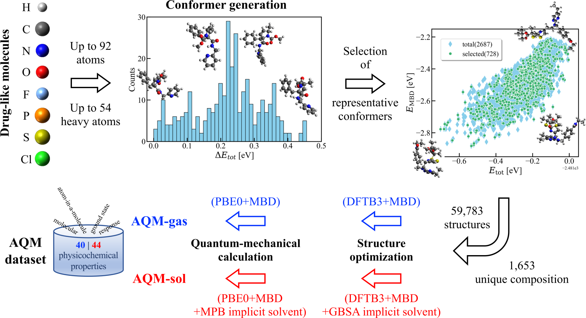

[](https://www.nature.com/articles/s41597-024-03521-8)

# Aquamarine (AQM) dataset
This github repository aims at providing user guide for the use of AQM dataset.



## AQM dataset files
The dataset files can be downloaded from the ZENODO repository.

[](https://doi.org/10.5281/zenodo.10208010)

## Delta learning project
We have reported initial results demonstrating that a machine learning model trained to learn the difference between the values of properties in implicit water (P-sol) and those in the gas phase (P-gas) can predict solvated-phase properties with greater precision than a model trained directly on P-sol values. 

[](https://link.springer.com/chapter/10.1007/978-3-031-72381-0_5)

## Acknowledgements
The authors are grateful for financial support from the European Union’s Horizon 2020 research and innovation program under the Marie Sklodowska-Curie grant agreement No 956832, “Advanced Machine Learning for Innovative Drug Discovery” (AIDD). 

## Citations
If you use the dataset please cite
```
@article{aqm1,
  title={Dataset for quantum-mechanical exploration of conformers and solvent effects in large drug-like molecules},
  author={Medrano Sandonas, Leonardo and Van Rompaey, Dries and Fallani, Alessio and Hilfiker, Mathias and Hahn, David and Perez-Benito, Laura and Verhoeven, Jonas and Tresadern, Gary and Kurt Wegner, Joerg and Ceulemans, Hugo and others},
  journal={Sci. Data},
  volume={11},
  number={1},
  pages={742},
  year={2024},
  publisher={Nature Publishing Group UK London},
  doi={10.1038/s41597-024-03521-8}
}

@InProceedings{aqm2,
author="Hilfiker, Mathias and Medrano Sandonas, Leonardo  and Kl{\"a}hn, Marco and Engkvist, Ola and Tkatchenko, Alexandre",
editor="Clevert, Djork-Arn{\'e} and Wand, Michael and Malinovsk{\'a}, Krist{\'i}na and Schmidhuber, J{\"u}rgen and Tetko, Igor V.",
title="Leveraging Quantum Mechanical Properties to Predict Solvent Effects on Large Drug-Like Molecules",
booktitle="AI in Drug Discovery",
year="2025",
publisher="Springer Nature Switzerland",
address="Cham",
pages="47--57",
isbn="978-3-031-72381-0"
}
```

